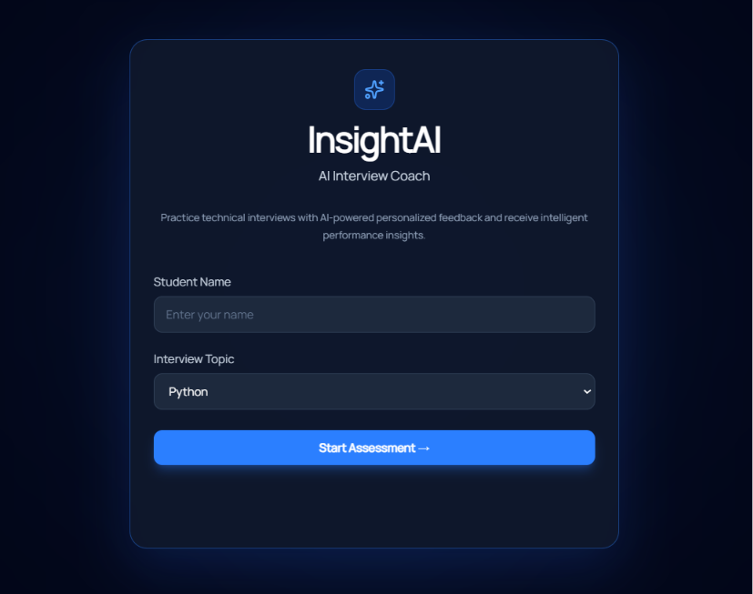
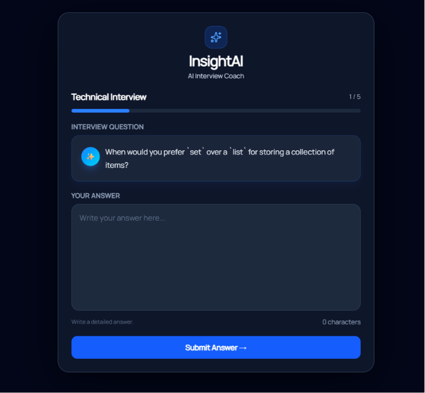
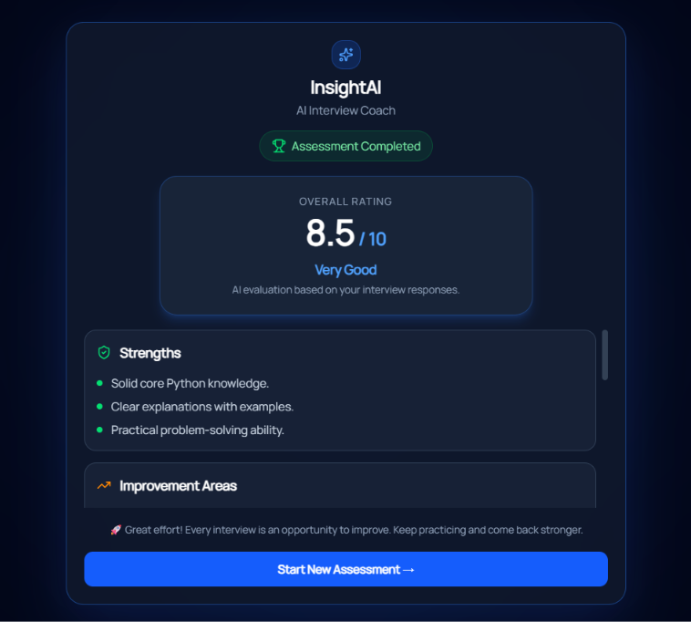

# 🚀 InsightAI – AI Student Skill Analyzer

InsightAI is an AI-powered interview assessment platform that helps Computer Science students evaluate their technical skills through AI-generated interview questions.

The application conducts a short technical interview, evaluates the student's responses using Google's Gemini API, and generates a personalized assessment report with strengths, improvement areas, learning recommendations, learning resources, and the next skill to learn.

---

## ✨ Features

- 👤 Student profile collection
- 💻 Skill-based interview assessment
- 🤖 AI-generated interview questions using Gemini
- 📝 AI evaluation of responses
- 📊 Overall performance rating
- ✅ Strengths analysis
- 📈 Improvement areas
- 💡 Learning recommendations
- 📚 Suggested learning resources
- 🚀 Next skill recommendation
- 💾 SQLite database integration
- ⚡ Modern React + FastAPI architecture
---

## 🛠️ Tech Stack

### Frontend
- React.js
- Tailwind CSS
- Axios
- Lucide React

### Backend
- FastAPI
- SQLModel
- SQLite
- Pydantic

### AI
- Google Gemini API (gemini-2.5-flash)

### Programming Language
- Python
- JavaScript

### Development Tools
- Visual Studio Code
- Git & GitHub

---

## 📁 Project Structure

```text
InsightAI/
│
├── backend/
│   ├── app/
│   │   ├── api/
│   │   ├── database/
│   │   ├── models/
│   │   ├── prompts/
│   │   ├── schemas/
│   │   ├── services/
│   │   ├── config.py
│   │   └── main.py
│   ├── requirements.txt
│   └── .env
│
├── frontend/
│   ├── src/
│   │   ├── pages/
│   │   ├── services/
│   │   ├── App.jsx
│   │   └── main.jsx
│
├── docs/
│
└── README.md
```

---

## 🎯 Key Features

- AI-generated interview questions based on the selected skill.
- Interactive interview experience with a progress tracker.
- AI evaluation of interview responses.
- Personalized assessment report.
- Learning recommendations and resources.
- Suggested next skill to learn.
- Responsive and modern user interface.
- SQLite database for assessment storage.

---

## ⚙️ Installation

### 1. Clone the Repository

```bash
git clone https://github.com/<your-username>/InsightAI.git
```

```bash
cd InsightAI
```

---

### 2. Backend Setup

```bash
cd backend
```

Create a virtual environment:

```bash
python -m venv venv
```

Activate the virtual environment.

**Windows**

```bash
venv\Scripts\activate
```

**Linux / macOS**

```bash
source venv/bin/activate
```

Install the dependencies:

```bash
pip install -r requirements.txt
```

Create a `.env` file inside the backend folder:

```env
GEMINI_API_KEY=YOUR_GEMINI_API_KEY
```

Start the backend server:

```bash
uvicorn app.main:app --reload
```

Backend URL:

```
http://127.0.0.1:8000
```

---

## 💻 Frontend Setup

Open a new terminal.

```bash
cd frontend
```

Install dependencies:

```bash
npm install
```

Start the React development server:

```bash
npm run dev
```

Frontend URL:

```
http://localhost:5173
```
---

## 📡 API Endpoints

| Method | Endpoint | Description |
|--------|----------|-------------|
| POST | `/assessment/start` | Start a new assessment |
| POST | `/assessment/answer` | Submit an interview answer |
| POST | `/assessment/report` | Generate the final AI assessment report |

---

## 📷 Application Screenshots

### 🏠 Welcome Page




---

### 💬 Interview Page



---

### 📊 Assessment Report



---

## 🌱 Future Enhancements

- Adaptive AI-generated interview questions
- User authentication
- Assessment history
- Resume analysis
- Voice-based interviews
- Multi-domain assessments
- Performance analytics dashboard


---

## 👨‍💻 Author

**Sneha Jain**

B.Tech Computer Science Student

Built as a Summer Internship Project using React, FastAPI, SQLite, and Google Gemini API.